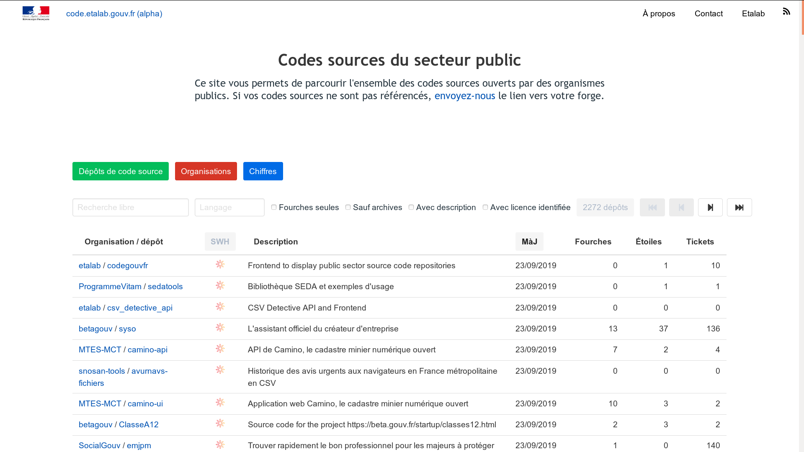

# code.gouv.fr/sources

This repository contains the Web application for exploring source code from the french public sector.  Its official instance is available on [code.gouv.fr/sources](https://code.gouv.fr/sources/).

*If you are looking for the source code of the main `code.gouv.fr` website, check [codegouvfr-website](https://github.com/codegouvfr/codegouvfr-website.)*

# Get the data

Data used for [code.gouv.fr/sources](https://code.gouv.fr/sources) are maintained on [codegouvfr-data](https://github.com/codegouvfr/codegouvfr-data) and consolidated by [this script](https://github.com/codegouvfr/codegouvfr-cli/tree/main/item/src/codegouvfr-output-data.clj).

From these sources, data are then fetched by [codegouvfr-fetch-data](https://git.sr.ht/~codegouvfr/codegouvfr-fetch-data) and consolidated with [codegouvfr-consolidate-data](https://git.sr.ht/~codegouvfr/codegouvfr-consolidate-data).

- Organizations: as [csv](https://code.gouv.fr/data/organizations/csv/all.csv) or [json](https://code.gouv.fr/data/organizations/json/all.json)
- Repositories: as [csv](https://code.gouv.fr/data/repositories/csv/all.csv) or [json](https://code.gouv.fr/data/repositories/json/all.json)
- Dependencies: [json](https://code.gouv.fr/data/deps.json)

# Develop

    ~$ git clone https://github.com/codegouvfr/codegouvfr-sources
    ~$ cd codegouvfr-sources/
    ~$ clj -M:fig

This will open you browser at `http://localhost:9500` where you can see your changes as you hack.

**Note**: if you don't have the `clj` executable, try `apt install clojure` or [follow the instructions](https://clojure.org/guides/getting_started) on clojure.org.

# [Contributing](CONTRIBUTING.md)

# Support the Clojure(script) ecosystem

If you like Clojure(script), please consider supporting maintainers by donating to [clojuriststogether.org](https://www.clojuriststogether.org).

# Licenses

2019-2025 DINUM, Bastien Guerry.

This application is published under the [EPL 2.0 license](LICENSES/LICENSE.EPL-2.0.txt).

The data referenced in this `README.md` and exposed on `code.gouv.fr` are published under the [Etalab 2.0 license](LICENSES/LICENSE.Etalab-2.0.md).
