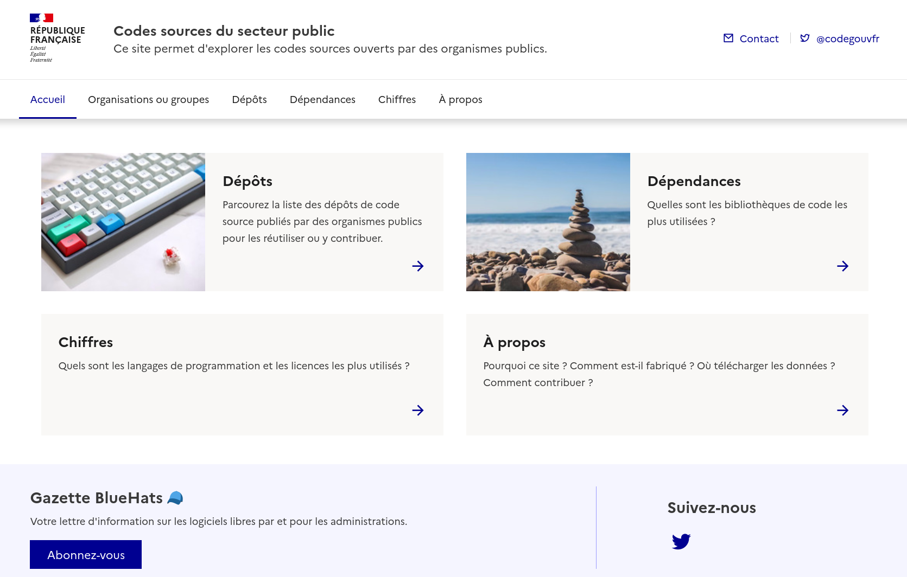

# code.etalab.gouv.fr

Browse public sector source code repositories.

This frontend retrives information source code [repositories](https://api-code.etalab.gouv.fr/api/repertoires/all) and [organizations](https://api-code.etalab.gouv.fr/api/organisations/all) from the french public sector.  The source code for creating these endpoints can be found [here](https://github.com/etalab/data-codes-sources-fr).

# Develop

    ~$ git clone https://github.com/etalab/code.etalab.gouv.fr
    ~$ cd code.etalab.gouv.fr/
    ~$ clj -A:test
    ~$ clj -A:fig

Then check <http://locahost:9500> then hack and see changes going live.

# Deploy

## Configure environment variables

You will need to configure these environment variables:

    SMTP_HOST: the host from which to send emails
    SMTP_LOGIN: the smtp login to use to send emails
    SMTP_PASSWORD: the smtp password to use to send emails
    CODEGOUVFR_ADMIN_EMAIL: the email where to receive messages
    CODEGOUVFR_FROM: the From header for sent emails
    CODEGOUVFR_PORT: the port to run the application
    CODEGOUVFR_MSGID_DOMAIN: what fqdn to use to build the message-id

## Deploy as a jar

    ~$ git clone https://github.com/etalab/code.etalab.gouv.fr
    ~$ cd code.etalab.gouv.fr/
    ~$ clj -A:fig
    ~$ clj -A:jar
    ~$ java -cp codegouvfr.jar clojure.main -m codegouvfr.server

Then go to <https://localhost:3000> or to your custom base URL.

## Deploy with Docker

Assuming your environments variables are stored in `~/.codegouvfr_envs`
and you want to expose the 3000 port:

    ~$ git clone https://github.com/etalab/code.etalab.gouv.fr
    ~$ cd code.etalab.gouv.fr/
    ~$ clj -A:fig
    ~$ clj -A:jar
    ~$ docker build -t codegouvfr .
    ~$ docker run -it -p 3000:3000 --env-file=~/.codegouvfr_envs codegouvfr

Then go to <http://localhost:3000>.

# Roadmap

There is no real roadmap but you can check [our issues](https://github.com/etalab/code.etalab.gouv.fr/issues) to see if you can help or suggest a feature.

# Contribute

Your help is welcome.  You can contribute with bug reports, pull requests or feature requests.

## Translation

If you want to help with the translation:

- add your language to `src/cljc/codegouvfr/i18n.cljc`
- add relevant variables to `src/clj/codegouvfr/views.clj`

Hack and send a *pull request*, I would be happy to integrate your contribution.

# Support the Clojure(script) ecosystem

If you like Clojure(script), please consider supporting maintainers by donating to [clojuriststogether.org](https://www.clojuriststogether.org).

# License

2019-2020 DINUM, Bastien Guerry.

This application is published under the EPL 2.0 license.
